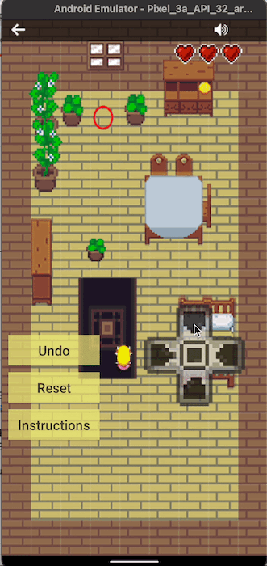
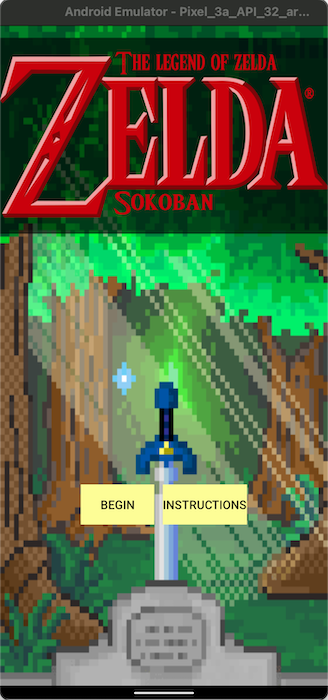
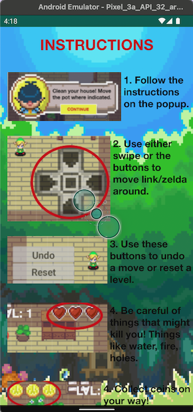
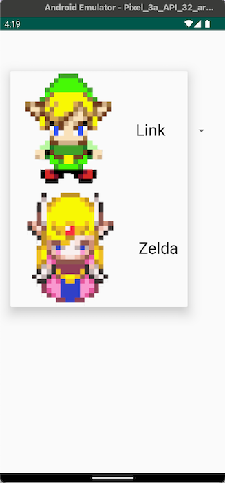
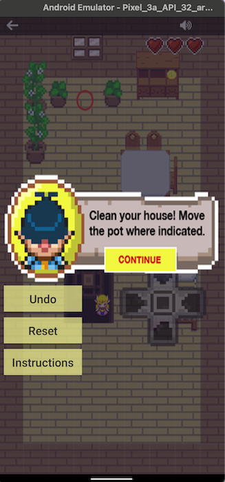
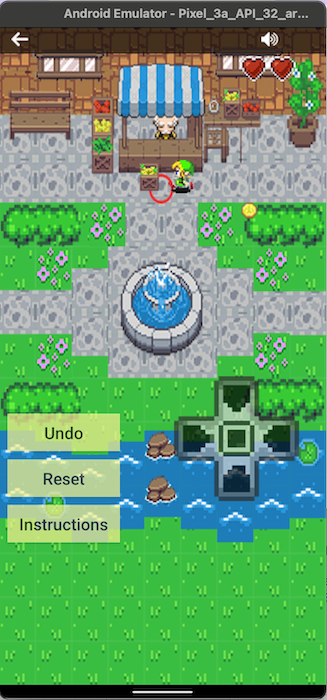

# zeldaSokoban

## Description
👑 Created a 3 level Sokoban game using arrays, implementing dynamic character movement and a cozy pixel theme.

This Android App utilizes multi-dimensional arrays to generate level outlines, allowing the user to move the plant to the designated area. The user is involved in an immersive experience through level prompts by characters, collecting coins throughout the game and having a limited number of lives.

## Built With
* [Android 28 SDK](https://developer.android.com/studio?gclid=CjwKCAiA3L6PBhBvEiwAINlJ9AMi9sX40UsqYnm6axdtDtwjCK4S5xTINjIwqU_zDZy1dNupQqheThoCvl4QAvD_BwE&gclsrc=aw.ds)

## Current Features
The current features include:
- Character selection (Link & Zelda)
- Dynamic Character Movement
- 3 game levels
- Undo Character Movement

### Splash Screen

### Instructions

### Character Selection

### Level Prompt

### Level 2

